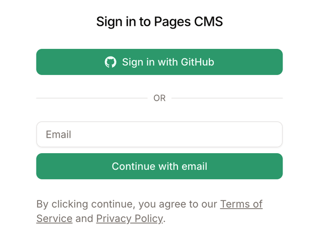
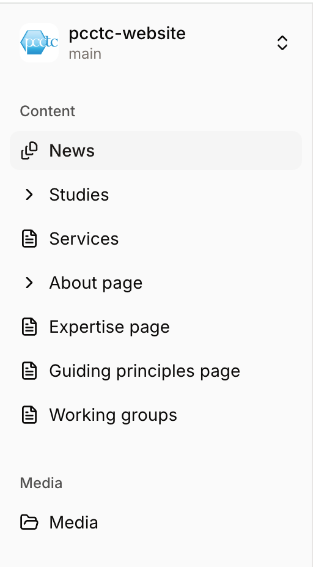
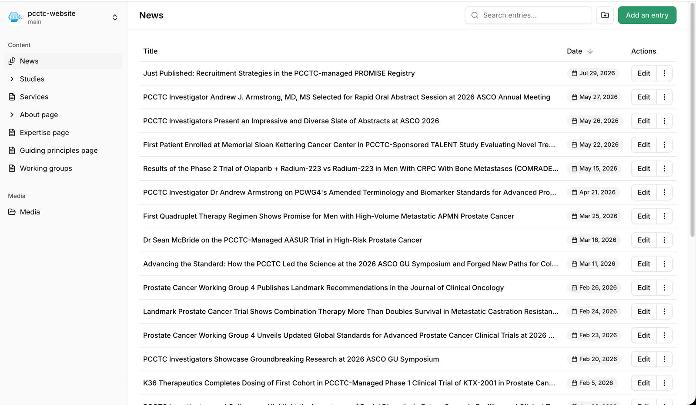
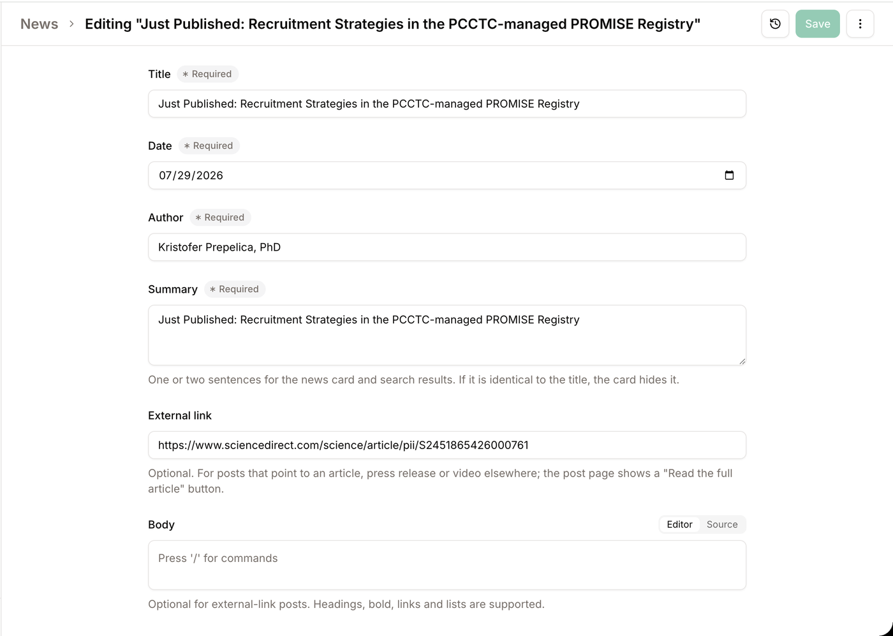
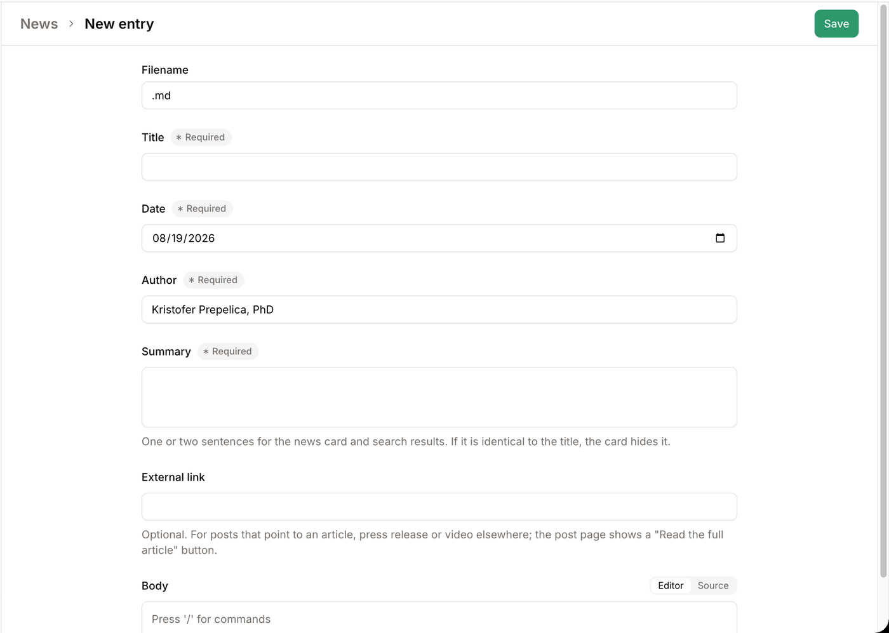
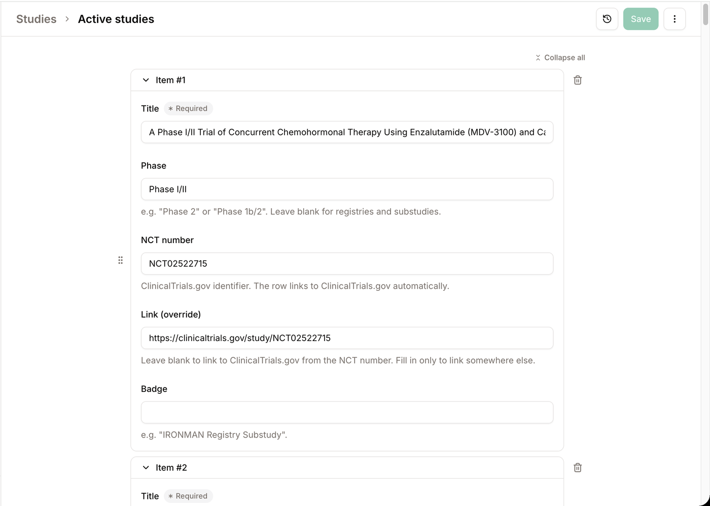
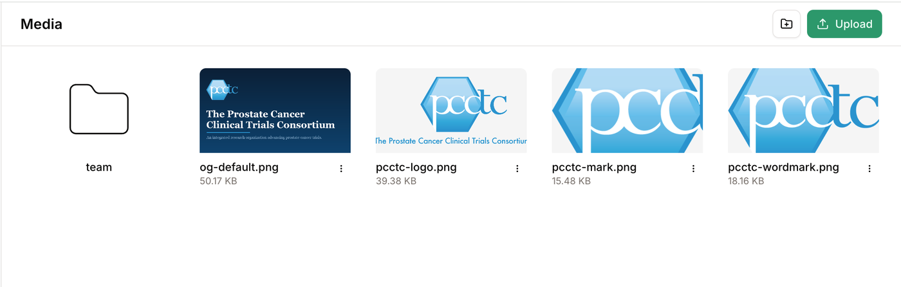

# Editing pcctc.org

A guide for keeping the PCCTC website up to date. You don't need any technical background;
if you can fill in a web form, you can edit the site. The site's content is yours to run:
posts, studies, team changes, text fixes, all of it, without checking in with anyone.

## How it works, in one paragraph

Everything you see on pcctc.org (news posts, the study lists, the team page, the text on
most pages) lives in plain text files. Pages CMS is a website, https://app.pagescms.org, that
shows those files to you as ordinary forms. When you press **Save**, your change is recorded,
the site rebuilds itself, and a few minutes later the change is live. Every save is kept
forever, so anything can be undone. And nothing you do in the editor can take the site
offline: if a change can't be built for some reason, the site keeps showing the previous
version and Travis is notified automatically.

## Signing in

There is no password. Each time you sign in, a six-digit code is emailed to you.

1. The first time, open the invitation email (subject: *Join "pcctc/pcctc-website" on
   Pages CMS*) and click the link. After that, just go to **https://app.pagescms.org**.
2. Type your email address and click **Continue with email**. Ignore the
   "Sign in with GitHub" button; that's for developers.
3. Check your inbox for an email with the subject *Your Pages CMS temporary code is 123456*
   and type the six digits. Codes expire after five minutes; if yours has, click resend.
4. You'll land on **pcctc-website**. Bookmark https://app.pagescms.org so you can come
   straight back.

Tip: your email inbox is the key to the site, so keep it secure, and never forward a code
to anyone.

## Finding your way around

The sidebar on the left lists everything you can edit. Each item corresponds to a part of
the site:

| In the sidebar | What it changes on the site |
|---|---|
| **News** | the posts on pcctc.org/news, and the three newest on the homepage |
| **Studies → Featured studies** | the three highlighted study cards on the homepage and at the top of /studies |
| **Studies → Active studies** | the "Currently open studies" list on /studies |
| **Services** | the service descriptions on /services, and the service cards on the homepage |
| **About page → Management team** | names, titles and headshots on /about |
| **About page → Scientific Oversight Committee** | the committee list on /about |
| **About page → Participating sites** | the US and international site lists on /about |
| **About page → Key numbers** | the four big statistics on the homepage and /about |
| **Expertise page** | the four sections of text on /expertise |
| **Guiding principles page** | the numbered principles on /guidingprinciples |
| **Working groups** | the two working groups and their publication lists on /workinggroups |
| **Media** | the image library (headshots, graphics) |

A few parts of the site are not in this list: the homepage text, the mission and history on
/about, the /talent page, the privacy page, and the banner text at the top of each page.
Those live in the site's templates rather than its content and change rarely. If one of them
needs editing, or the site needs a new section, that's a change to the structure; bring it to
Travis (see "When to bring in Travis").

## Editing something that already exists

Take a typo in a news post as the example.

1. Click **News** in the sidebar. You'll see the posts, newest first. Use the search box
   ("Search entries...") if you're looking for a specific one.
2. Click the post. It opens as a form.
3. Make your change.
4. Click the green **Save** button at the top right. You'll briefly see "Saving your file",
   then a confirmation. That's it; the site will update on its own (see "What happens after
   you save" below).

Notes:

- **Save stays greyed out until you've changed something.** If it won't light up, nothing is
  different yet.
- Under some fields you'll see short help text explaining what they're for. If a field has
  a problem (a link without `https://`, an NCT number in the wrong format), a red message
  appears under it and Save won't go through until it's fixed.
- The clock icon next to Save opens the **History** of that item: every past save, with who
  made it and when.
- The **⋮** menu next to Save is where **Delete** lives, if a post needs to come down
  entirely. It asks you to confirm.

### The fields on a news post

| Field | What to put there |
|---|---|
| **Title** | The headline. For a new post this also becomes the web address (see below). |
| **Date** | The publication date. Posts are listed newest first. |
| **Author** | Pre-filled; change it only if someone else wrote the post. |
| **Summary** | One or two sentences shown on the news card and in search results. Make it different from the title; if it's identical, the card hides it. |
| **External link** | Only for posts that point somewhere else (a journal article, a press release, a video). Paste the full address starting with `https://`. The post page then shows a "Read the full article" button. |
| **Body** | The text of the post. Optional for external-link posts. Select some text to make it bold or italic or to add a link; type **/** on an empty line for a menu of headings, lists, quotes and images. Use Heading 2 or 3 for subheadings (the title is already the page's main heading). |

## Adding a news post

1. Click **News**, then the green **Add an entry** button at the top right.
2. At the top of the form is a **Filename** box. It fills itself in as you type the title,
   and it is the post's web address: a title of *Just Published: Recruitment Strategies in the
   PROMISE Registry* gives `pcctc.org/news/just-published-recruitment-strategies-in-the-promise-registry`.
   You can shorten it before the first save (keep the `.md` at the end); after that it can't
   be changed, because renaming would break links and search rankings. So settle the title
   first.
3. The date is set to today and the author is pre-filled; change either if needed. Fill in
   the rest, write the body (or paste the external link), and **Save**. On a new post Save
   is active from the start, so if you press it too early you'll be shown which required
   fields are still empty.

Two kinds of posts exist on the site, and both are fine:

- **A link-out post**: title, date, summary and an External link, with no body. The post page
  shows the summary and a "Read the full article" button.
- **A full post**: title, date, summary and a body written in the editor, with or without an
  external link.

## Editing lists: studies, services, team, sites, numbers, publications

These sections open as one long form with one card per item. The cards are numbered
(Item #1, Item #2, ...) rather than titled, so to find a particular study or person use
your browser's Find (Cmd+F on a Mac, Ctrl+F on Windows) and type part of the name.

- Edit any card and **Save** once at the end; you don't need to save after each item.
- **Add an item** (at the bottom) adds a blank card.
- Drag a card by the dotted handle on its left to reorder. The order here is the order on
  the site.
- The trash icon on the right removes a card (it asks you to confirm). Removing a card from the list is
  how you take a study or a person off the site; there's no separate "delete" step.
- Study links: for an active study, fill in the **NCT number** and leave **Link (override)**
  blank; the site links to ClinicalTrials.gov by itself.
- The **Anchor** field on services, expertise sections and working groups is part of a web
  address that other pages link to. Leave it alone on existing items.

## Images

- **Media** in the sidebar is the image library. Headshots live in the `team` folder. Drag
  an image onto the page or use the **Upload** button at the top right. Give files sensible names before uploading (`smith-headshot.jpg`, not
  `IMG_4821.jpg`); the name becomes part of the image's web address.
- To add a headshot, open **Management team**, find the person's card, and use the
  **Headshot** picker to choose an uploaded image. Headshots are shown square; something
  around 600 × 600 pixels is plenty.
- To put an image in a news post, type **/** on an empty line in the body and choose
  **Image**.
- **Only upload images PCCTC owns**: headshots, our own graphics, photos we took. No stock
  photography and nothing copied from another website.

About the old site's pictures, in case you wonder why they didn't come across: the previous
site was built for us by an outside consultant, and its decorative photos were stock images.
A stock-photo license belongs to whoever bought it, and we have no record of PCCTC holding
those licenses; they most likely sat with the consultant or came with the Squarespace
template. Reusing the pictures would have been a copyright risk, so we left them behind and
kept only what is clearly ours: the logo and the team headshots. If you're unsure whether an
image is ours to use, ask Travis. If we want decorative photography again, we'd license it
in PCCTC's name or take our own.

## What happens after you save

1. Your change is recorded immediately. You can see it in the item's History.
2. The site rebuilds, which usually takes two to five minutes, occasionally up to ten.
3. Open the page on pcctc.org to check. If you still see the old version, your browser may
   be showing you a copy it kept: hold **Shift** and click the reload button, or open the
   page in a private/incognito window. Browsers keep a copy for up to ten minutes.

There is no draft mode and no preview: saving publishes. So read your change over before you
save, and look at the live page afterwards. If you save something you didn't mean to, just
edit it again and save; the fix publishes the same way.

## If something doesn't look right

| What you see | What's going on | What to do |
|---|---|---|
| Save is greyed out | Nothing has changed yet (on an existing item, Save only lights up once something differs) | Make your change; if you already did, check it actually registered |
| "Please fix the errors before saving" | A field has a red message under it | Scroll through the form and fix it (usually a link missing `https://`, or an empty required field) |
| A red error after pressing Save | The save didn't go through. If the message says the file has changed, someone else saved the same item first | Reload the page and redo the change. If it keeps failing for another reason, something is broken on the site's side: take a screenshot and send it to Travis |
| Your change isn't on the site after 10 minutes | Usually your browser's cached copy; occasionally a failed rebuild | Shift+reload or a private window. Check the item's History shows your save (it will). If it's still missing after 20 minutes, the rebuild probably failed; Travis is notified automatically when that happens and the site keeps showing the previous version meanwhile, so a quick note to him is all that's needed |
| You deleted or changed something by mistake | Nothing is lost; every save is kept | Edit and save again if it's quick. If it's a big one (a whole list gone), ask Travis to restore the earlier version; that takes him a minute |
| No sign-in code arrives | Mail delay or spam filter | Wait a minute, check spam, then click resend. Codes expire after five minutes |
| "Invite unavailable" or "This invitation link is invalid" | The invitation link was already used or has expired | Go to app.pagescms.org and sign in with your email as usual; if that fails, ask Travis for a fresh invitation |
| The editor looks broken or won't load | A hiccup on the editor's side | Reload the page; if that doesn't help, sign out and back in, or try another browser. If app.pagescms.org itself is down, your edits can wait; nothing is lost |

## Ground rules

- Saving publishes. There's no preview, so proofread first.
- A new post's web address comes from its title and is fixed at the first save.
- Don't edit **Anchor** fields on existing items.
- Only PCCTC-owned images.
- Keep the **Summary** different from the title.
- If two people edit the same item at the same time, the second save fails with an error
  (the file changed underneath it). Reload the page and make the change again.

## When to bring in Travis

Everything in this guide is yours to do without asking. Travis Gerke looks after the site's
structure, so he's the person for:

- a new section, page or field (say, a new list on a page, or a new kind of post);
- changes to text that isn't in the editor (homepage, About mission and history, /talent,
  privacy, page banners);
- anything that looks broken after you've tried the troubleshooting table;
- access problems, such as a fresh invitation;
- an image question you're not sure about (ownership, or where it should go).

When you write, say what you were trying to do and include a screenshot if there's an error
message.

## Your first session

1. Sign in and bookmark https://app.pagescms.org.
2. Open **News**, open the newest post, and look around. Close it without saving.
3. Open **Studies → Active studies** to see what a list form looks like.
4. Make one small, real edit (a typo anywhere will do) and watch it go live.
5. Post your first news item the same way. Read it over once before saving, then check the
   live page a few minutes later.

## A few words you'll see

- **Entry**: one item in a list, such as one news post.
- **Filename**: the last part of a post's web address, ending in `.md`.
- **Save**: record the change and publish it.
- **History**: the list of past saves for an item.
- **pcctc-website** and **main**: the name of the site's file collection and its one
  working copy. You'll always be in these; there's nothing to choose.
